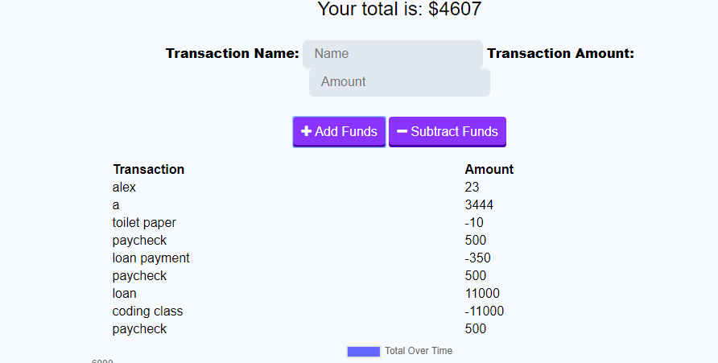

# ProgressiveBudget

With this app you can add funds to your budget and also subtract from it.

Simply type in the amount of money you want to add or take away and what it is for/from and then click one the add or subtract button and the budget will automatically change.

The app will also keep track of the changes to your budget so you don't forget what you have spend your money on.

